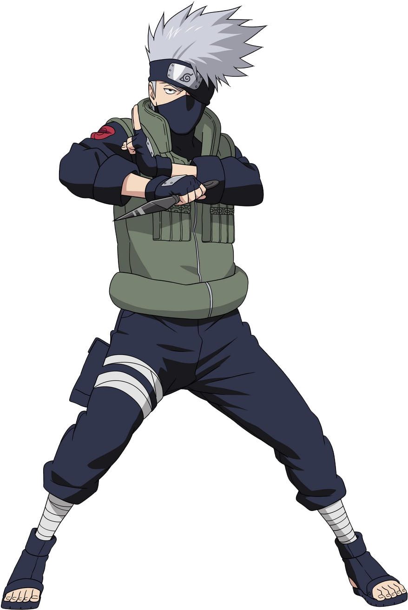

# Readme Template

### Paragraph
<p>I am nazmul hossain. I am a student of CSE.</p>

### Italic 
_This is italic_  

### HTML Code
``` html
<html>
    <head>

    </head>
    <body>

    </body>
</html>
```

### Javascript Code
```javascript
function sendRequest(method, url){
    const promise = new Promise((resolve, reject) => {
        const xhr = new XMLHttpRequest();

        xhr.onload = function(){
            resolve(this.response);
        };
    
        xhr.open(method, url);

        xhr.responseType = "json";

        xhr.send();
    });
}
```
<br>

### List
1. Item 1
2. Item 2
    1. Item 2 1
    2. Item 2 2
3. Item 3

<br>

### Task Bar
- [x] Task 1
- [x] Task 2
- [] Task 3


### Links 
[Link 1](http://www.cop.com)

### Image
  

### Emoji
😀